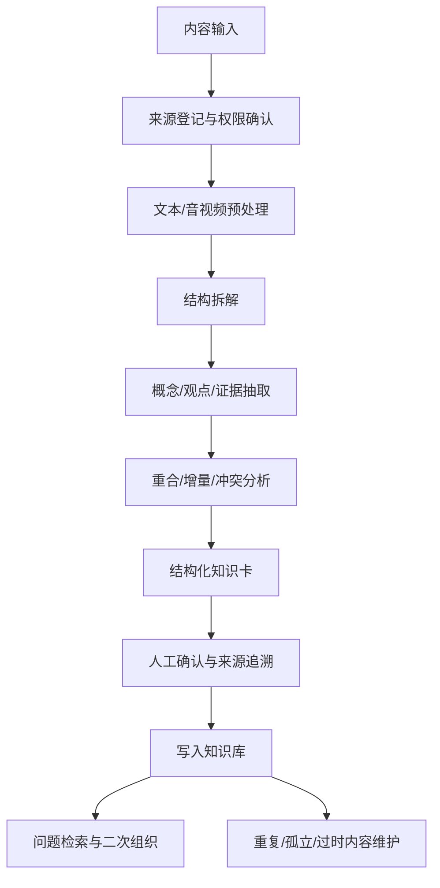

# 工作流与架构

## 总体流程

## 四层模型

### 输入层

接收书籍章节、网页、报告、视频/播客转写、会议记录和已有笔记。

### 理解层

识别内容结构、概念、事实、观点、证据、建议和不确定性。

### 对齐层

比较多个来源的重合、增量、冲突、层级差异和证据差异。

### 资产层

把结果写成内容卡、概念卡、观点卡、对比卡和维护报告，供后续检索和复用。

## 质量闸门

每条正式知识资产至少应能回答：

1. 它来自哪里？
2. 这是事实、观点、推测还是建议？
3. 还有哪些来源说法不同？
4. 哪些部分已经确认，哪些部分仍待验证？
5. 后续用户如何找到并复用它？

